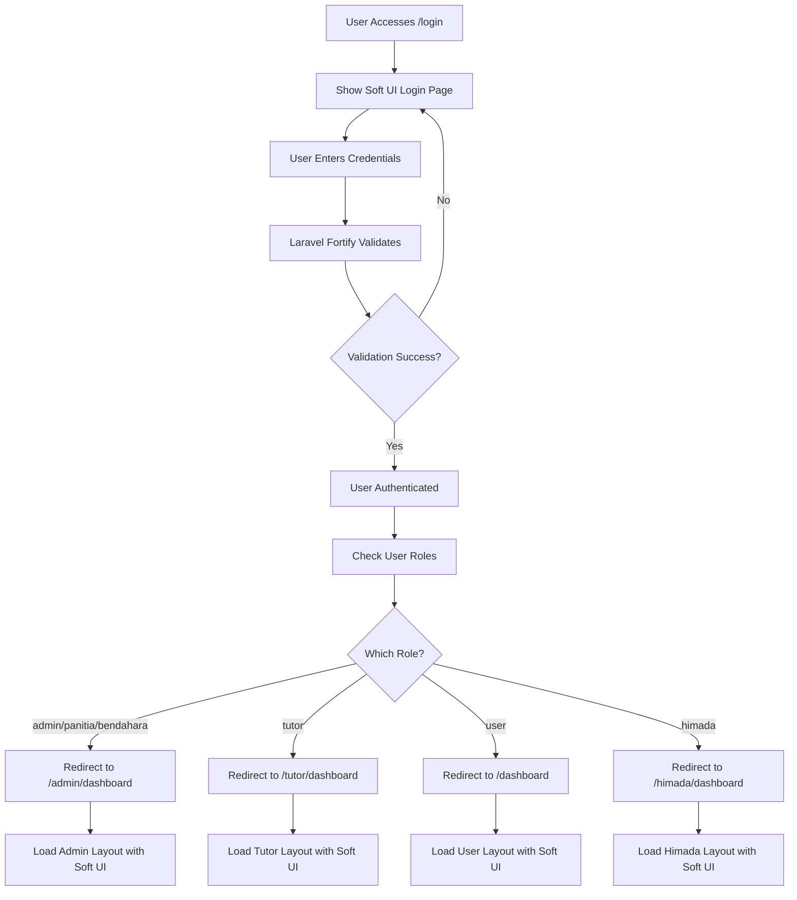

# Arsitektur Redesign Aplikasi Try-Out

## 📋 Executive Summary

Dokumen ini menjelaskan arsitektur lengkap untuk redesign aplikasi Try-Out dengan menggunakan **Soft UI Dashboard** sebagai template utama. Redesign ini mencakup:

- ✅ Sistem authentication untuk 3 roles (User, Tutor, Admin)
- ✅ Auto-detect role setelah login
- ✅ Assets management terpusat di `public/assets/`
- ✅ Mempertahankan semua fungsionalitas existing
- ✅ Modern, responsive, dan mudah di-customize

---

## 🎯 Design Goals

### Primary Goals
1. **Modern UI/UX** - Menggunakan Soft UI Dashboard yang clean dan professional
2. **Role-Based Interface** - Setiap role mendapat tampilan yang sesuai kebutuhan
3. **Easy Customization** - Assets mudah diganti tanpa edit code
4. **Backward Compatible** - Semua fungsi existing tetap bekerja

### Technical Goals
1. Centralized asset management
2. Consistent design language across all roles
3. Maintainable code structure
4. Performance optimization

---

## 🏗️ Current System Analysis

### Existing Structure

#### Authentication System
- **Framework**: Laravel Jetstream + Fortify
- **Roles Management**: Spatie Laravel Permission
- **Current Roles**:
  - `user` - Peserta try-out
  - `tutor` - Pengajar/pembuat materi
  - `admin` - Administrator penuh
  - `panitia` - Admin dengan akses terbatas
  - `bendahara` - Admin keuangan
  - `himada` - Admin organisasi

#### Current Templates
1. **Stisla** - Currently used for auth pages and admin
2. **Soft UI Dashboard** - Available but not integrated
3. **AdminLTE** - Partial usage
4. **Bootslander** - Landing page

#### Current Routes Structure
```
/ → Dashboard (auto-redirect based on role)
/login → Authentication
/admin/* → Admin routes (role: admin|panitia|bendahara)
/tutor/* → Tutor routes (role: tutor)
/tryout/* → User routes (role: user)
/himada/* → Himada routes (role: himada)
```

---

## 🎨 New Design Architecture

### Template Selection: Soft UI Dashboard

**Why Soft UI Dashboard?**
- ✅ Modern and professional design
- ✅ Fully responsive (mobile-first)
- ✅ Rich component library
- ✅ Soft shadows and gradients
- ✅ Already available in project
- ✅ Bootstrap 5 based

**Key Features:**
- Glassmorphism design elements
- Smooth animations
- Comprehensive form components
- Pre-built dashboard layouts
- Dark mode ready

---

## 📁 New Assets Structure

### Proposed Directory Structure

```
public/
├── assets/                          # NEW: Centralized assets
│   ├── config/
│   │   └── branding.json           # Configuration file for easy customization
│   ├── images/
│   │   ├── logo/
│   │   │   ├── logo-main.png       # Main logo (transparent background)
│   │   │   ├── logo-light.png      # Logo for dark backgrounds
│   │   │   ├── logo-dark.png       # Logo for light backgrounds
│   │   │   ├── logo-icon.png       # Square icon/favicon
│   │   │   └── logo-text.png       # Logo text only
│   │   ├── backgrounds/
│   │   │   ├── login-bg.jpg        # Login page background
│   │   │   ├── auth-pattern.svg    # Authentication pages pattern
│   │   │   ├── dashboard-hero.jpg  # Dashboard hero images
│   │   │   └── wave-*.svg          # Decorative waves
│   │   ├── illustrations/
│   │   │   ├── empty-state.svg     # Empty state illustrations
│   │   │   ├── error-*.svg         # Error page illustrations
│   │   │   └── success.svg         # Success illustrations
│   │   ├── avatars/
│   │   │   └── default-avatar.png  # Default user avatar
│   │   └── banners/
│   │       ├── hero-user.jpg       # User dashboard banner
│   │       ├── hero-tutor.jpg      # Tutor dashboard banner
│   │       └── hero-admin.jpg      # Admin dashboard banner
│   ├── css/
│   │   ├── soft-ui/                # Soft UI Dashboard CSS
│   │   ├── custom/
│   │   │   ├── variables.css       # Custom CSS variables
│   │   │   ├── user-theme.css      # User role specific styles
│   │   │   ├── tutor-theme.css     # Tutor role specific styles
│   │   │   └── admin-theme.css     # Admin role specific styles
│   │   └── components/
│   │       ├── card-custom.css     # Custom card styles
│   │       ├── button-custom.css   # Custom button styles
│   │       └── table-custom.css    # Custom table styles
│   ├── js/
│   │   ├── soft-ui/                # Soft UI Dashboard JS
│   │   ├── custom/
│   │   │   ├── app.js              # Main application JS
│   │   │   ├── role-detector.js    # Role detection logic
│   │   │   └── asset-manager.js    # Dynamic asset loading
│   │   └── components/
│   │       ├── datatables.js       # DataTables configuration
│   │       ├── charts.js           # Chart.js configuration
│   │       └── forms.js            # Form validation
│   └── fonts/
│       └── [fonts from Soft UI]
├── softUI/                          # KEEP: Original Soft UI reference
├── stisla/                          # DEPRECATED: Will be replaced
├── adminLTE/                        # DEPRECATED: Will be replaced
└── Bootslander/                     # KEEP: For landing page
```

### Configuration File: `branding.json`

```json
{
  "app": {
    "name": "Try-Out STAN",
    "short_name": "TOSTAN",
    "description": "Platform Try-Out Online Terbaik",
    "url": "https://tryout.example.com"
  },
  "branding": {
    "logo": {
      "main": "/assets/images/logo/logo-main.png",
      "light": "/assets/images/logo/logo-light.png",
      "dark": "/assets/images/logo/logo-dark.png",
      "icon": "/assets/images/logo/logo-icon.png",
      "text": "/assets/images/logo/logo-text.png"
    },
    "favicon": "/assets/images/logo/logo-icon.png"
  },
  "theme": {
    "colors": {
      "primary": "#17c1e8",
      "secondary": "#7928ca",
      "success": "#82d616",
      "info": "#17c1e8",
      "warning": "#f53939",
      "danger": "#ea0606",
      "light": "#e9ecef",
      "dark": "#344767"
    },
    "fonts": {
      "primary": "Open Sans",
      "headings": "Roboto"
    }
  },
  "backgrounds": {
    "login": "/assets/images/backgrounds/login-bg.jpg",
    "auth_pattern": "/assets/images/backgrounds/auth-pattern.svg",
    "dashboard_user": "/assets/images/banners/hero-user.jpg",
    "dashboard_tutor": "/assets/images/banners/hero-tutor.jpg",
    "dashboard_admin": "/assets/images/banners/hero-admin.jpg"
  },
  "social": {
    "facebook": "https://facebook.com/yourpage",
    "twitter": "https://twitter.com/yourhandle",
    "instagram": "https://instagram.com/yourhandle",
    "youtube": "https://youtube.com/yourchannel"
  }
}
```

---

## 🔐 Authentication System Design

### Auto-Detect Role Flow



### Implementation Details

#### 1. Update RedirectIfAuthenticated Middleware

```php
// app/Http/Middleware/RedirectIfAuthenticated.php
public function handle(Request $request, Closure $next, string ...$guards): Response
{
    foreach ($guards as $guard) {
        if (Auth::guard($guard)->check()) {
            $user = Auth::user();
            
            // Auto-detect role and redirect
            if ($user->hasRole(['admin', 'panitia', 'bendahara'])) {
                return redirect('/admin/dashboard');
            } elseif ($user->hasRole('tutor')) {
                return redirect('/tutor/dashboard');
            } elseif ($user->hasRole('himada')) {
                return redirect('/himada/dashboard');
            } else {
                return redirect('/dashboard'); // Default for users
            }
        }
    }
    
    return $next($request);
}
```

#### 2. Create Role Detection Helper

```php
// app/Helpers/RoleHelper.php
<?php

namespace App\Helpers;

use Illuminate\Support\Facades\Auth;

class RoleHelper
{
    public static function getDashboardRoute(): string
    {
        $user = Auth::user();
        
        if (!$user) {
            return route('login');
        }
        
        if ($user->hasRole(['admin', 'panitia', 'bendahara'])) {
            return route('admin.dashboard');
        } elseif ($user->hasRole('tutor')) {
            return route('tutor.dashboard');
        } elseif ($user->hasRole('himada')) {
            return route('himada.dashboard');
        }
        
        return route('dashboard');
    }
    
    public static function getLayoutName(): string
    {
        $user = Auth::user();
        
        if ($user->hasRole(['admin', 'panitia', 'bendahara'])) {
            return 'admin';
        } elseif ($user->hasRole('tutor')) {
            return 'tutor';
        } elseif ($user->hasRole('himada')) {
            return 'himada';
        }
        
        return 'user';
    }
    
    public static function getThemeColor(): string
    {
        $user = Auth::user();
        
        if ($user->hasRole(['admin', 'panitia', 'bendahara'])) {
            return 'gradient-primary'; // Blue
        } elseif ($user->hasRole('tutor')) {
            return 'gradient-success'; // Green
        } elseif ($user->hasRole('himada')) {
            return 'gradient-warning'; // Orange
        }
        
        return 'gradient-info'; // Cyan for users
    }
}
```

---

## 🎨 Layout Design for Each Role

### Base Layout Structure (Soft UI)

All roles will share the same base Soft UI Dashboard structure with role-specific customizations:

```blade
<!-- resources/views/layouts/base-soft-ui.blade.php -->
<!DOCTYPE html>
<html lang="en">
<head>
    <meta charset="utf-8" />
    <meta name="viewport" content="width=device-width, initial-scale=1, shrink-to-fit=no">
    <meta name="csrf-token" content="{{ csrf_token() }}">
    
    <title>@yield('title') - {{ config('app.name') }}</title>
    
    <!-- Favicon -->
    <link rel="icon" type="image/png" href="{{ asset('assets/images/logo/logo-icon.png') }}">
    
    <!-- Fonts -->
    <link href="https://fonts.googleapis.com/css?family=Open+Sans:300,400,600,700" rel="stylesheet" />
    
    <!-- Font Awesome Icons -->
    <link rel="stylesheet" href="https://cdnjs.cloudflare.com/ajax/libs/font-awesome/6.4.0/css/all.min.css" />
    
    <!-- Soft UI Dashboard CSS -->
    <link id="pagestyle" href="{{ asset('assets/css/soft-ui/soft-ui-dashboard.css') }}" rel="stylesheet" />
    
    <!-- Custom Theme CSS -->
    <link href="{{ asset('assets/css/custom/variables.css') }}" rel="stylesheet" />
    <link href="{{ asset('assets/css/custom/' . RoleHelper::getLayoutName() . '-theme.css') }}" rel="stylesheet" />
    
    @stack('styles')
</head>

<body class="g-sidenav-show bg-gray-100">
    @include('layouts.partials.sidebar-' . RoleHelper::getLayoutName())
    
    <main class="main-content position-relative max-height-vh-100 h-100 border-radius-lg">
        @include('layouts.partials.navbar-' . RoleHelper::getLayoutName())
        
        <div class="container-fluid py-4">
            @yield('content')
            
            @include('layouts.partials.footer')
        </div>
    </main>
    
    <!-- Core JS Files -->
    <script src="{{ asset('assets/js/soft-ui/core/popper.min.js') }}"></script>
    <script src="{{ asset('assets/js/soft-ui/core/bootstrap.min.js') }}"></script>
    <script src="{{ asset('assets/js/soft-ui/plugins/perfect-scrollbar.min.js') }}"></script>
    <script src="{{ asset('assets/js/soft-ui/plugins/smooth-scrollbar.min.js') }}"></script>
    
    <!-- Custom JS -->
    <script src="{{ asset('assets/js/custom/app.js') }}"></script>
    
    @stack('scripts')
    
    <!-- Soft UI Dashboard JS -->
    <script src="{{ asset('assets/js/soft-ui/soft-ui-dashboard.min.js') }}"></script>
</body>
</html>
```

### 1. User Dashboard Layout

**Features:**
- Simple, clean interface focused on taking exams
- Quick access to purchased packages
- Score history
- FAQ and announcements

**Color Scheme:**
- Primary: Cyan/Teal (#17c1e8)
- Accent: Light gradients

**Sidebar Menu:**
```
📊 Dashboard
📝 Paket Try-Out
📚 Try-Out Saya
📈 Riwayat Nilai
💳 Pembelian
📢 Pengumuman
❓ FAQ
👤 Profil
```

### 2. Tutor Dashboard Layout

**Features:**
- Material management
- Live class scheduling
- Bank soal creation
- Student progress tracking

**Color Scheme:**
- Primary: Green (#82d616)
- Accent: Success gradients

**Sidebar Menu:**
```
📊 Dashboard
📹 Live Classes
📚 Materi
🎯 Bank Soal
📊 Laporan
👥 Peserta
👤 Profil
```

### 3. Admin Dashboard Layout

**Features:**
- Complete system management
- User management
- Exam creation and monitoring
- Financial reports
- System configuration

**Color Scheme:**
- Primary: Blue (#17c1e8)
- Accent: Primary gradients

**Sidebar Menu:**
```
📊 Dashboard
👥 Manajemen User
  ├─ Users
  ├─ Admin
  ├─ Tutor
  └─ Himada
📦 Paket Ujian
📝 Ujian
  ├─ Daftar Ujian
  └─ Soal
👨‍🎓 Peserta Ujian
💰 Pembelian
🎫 Voucher
📢 Pengumuman
❓ FAQ
📊 Bank Soal
⚙️ Pengaturan
```

---

## 🔄 Migration Strategy

### Phase 1: Preparation (Week 1)

**Tasks:**
1. ✅ Create new assets structure
2. ✅ Copy and organize Soft UI Dashboard files
3. ✅ Create branding.json configuration
4. ✅ Prepare all logo variations and images
5. ✅ Create helper classes and middleware

**Deliverables:**
- Complete `public/assets/` structure
- Configuration files
- Helper classes
- Documentation

### Phase 2: Authentication & Base Layout (Week 1-2)

**Tasks:**
1. ✅ Create new login page with Soft UI
2. ✅ Implement role detection logic
3. ✅ Create base layout template
4. ✅ Test authentication flow for all roles

**Testing:**
- Login as each role type
- Verify correct dashboard redirect
- Test logout functionality
- Verify session management

### Phase 3: User Interface (Week 2-3)

**Tasks:**
1. ✅ Migrate User dashboard and pages
2. ✅ Update user-facing forms and tables
3. ✅ Implement exam interface with new design
4. ✅ Test all user functionality

**Pages to Migrate:**
- Dashboard
- Paket try-out listing
- Exam interface
- Score history
- Purchase pages
- Profile

### Phase 4: Tutor Interface (Week 3)

**Tasks:**
1. ✅ Migrate Tutor dashboard
2. ✅ Update material management
3. ✅ Update live class interface
4. ✅ Update bank soal interface

**Pages to Migrate:**
- Tutor dashboard
- Live classes CRUD
- Materials CRUD
- Bank soal management

### Phase 5: Admin Interface (Week 4)

**Tasks:**
1. ✅ Migrate Admin dashboard
2. ✅ Update all admin CRUD interfaces
3. ✅ Implement new data tables
4. ✅ Update reporting interfaces

**Pages to Migrate:**
- Admin dashboard
- User management
- Paket ujian management
- Ujian and soal management
- Peserta ujian monitoring
- Pembelian management
- Voucher management
- System settings

### Phase 6: Testing & Refinement (Week 5)

**Tasks:**
1. ✅ Comprehensive testing of all features
2. ✅ Fix bugs and UI issues
3. ✅ Performance optimization
4. ✅ Mobile responsiveness testing
5. ✅ Cross-browser testing

**Testing Checklist:**
- [ ] All authentication flows
- [ ] All CRUD operations
- [ ] File uploads
- [ ] Payment integration
- [ ] Email notifications
- [ ] Search and filters
- [ ] Sorting and pagination
- [ ] Form validations
- [ ] Error handling

### Phase 7: Deployment (Week 6)

**Tasks:**
1. ✅ Backup current system
2. ✅ Deploy to staging environment
3. ✅ Final testing on staging
4. ✅ Deploy to production
5. ✅ Monitor for issues

---

## 🔄 Rollback Strategy

### Immediate Rollback (< 24 hours)

If critical issues are found within 24 hours:

1. **Database**: No changes needed (backward compatible)
2. **Views**: Restore from backup
3. **Assets**: Keep old folders intact during migration
4. **Routes**: No changes to routes, only views

**Rollback Command:**
```bash
# Restore views from backup
cp -r backup/resources/views/* resources/views/

# Restore public assets
cp -r backup/public/* public/

# Clear cache
php artisan cache:clear
php artisan view:clear
php artisan config:clear
```

### Gradual Rollback (After 24 hours)

If issues found after deployment:

1. Identify specific problematic module
2. Rollback only that module
3. Fix issues in development
4. Redeploy fixed module

---

## 📱 Responsive Design Strategy

### Breakpoints (Following Soft UI Dashboard)

```css
/* Extra small devices (phones, less than 576px) */
@media (max-width: 575.98px) { }

/* Small devices (tablets, 576px and up) */
@media (min-width: 576px) { }

/* Medium devices (desktops, 768px and up) */
@media (min-width: 768px) { }

/* Large devices (large desktops, 992px and up) */
@media (min-width: 992px) { }

/* Extra large devices (larger desktops, 1200px and up) */
@media (min-width: 1200px) { }
```

### Mobile-First Approach

1. **Navigation**: Collapsible sidebar on mobile
2. **Tables**: Horizontal scroll with fixed column
3. **Forms**: Stack fields vertically on mobile
4. **Cards**: Full width on mobile, grid on desktop
5. **Charts**: Responsive and touch-friendly

---

## 🎯 Key Features to Maintain

### User Features
- ✅ Google OAuth login
- ✅ Email verification
- ✅ Profile management
- ✅ Purchase packages
- ✅ Take exams with timer
- ✅ View scores and analytics
- ✅ Download certificates
- ✅ Apply vouchers

### Tutor Features
- ✅ Create and manage materials
- ✅ Schedule live classes
- ✅ Create bank soal
- ✅ View student progress
- ✅ Upload files (PDF, videos)

### Admin Features
- ✅ User management (all roles)
- ✅ Package management
- ✅ Exam creation and configuration
- ✅ Question bank management
- ✅ Purchase and payment monitoring
- ✅ Voucher generation
- ✅ Report generation and export
- ✅ System configuration

---

## 🛠️ Technical Implementation Details

### File Structure Changes

#### New Controllers
```
app/Http/Controllers/
├── AssetController.php              # Serves branding.json
└── (existing controllers remain)
```

#### New Middleware
```
app/Http/Middleware/
├── LoadBrandingAssets.php           # Loads branding config
└── (existing middleware remain)
```

#### New Views Structure
```
resources/views/
├── layouts/
│   ├── base-soft-ui.blade.php       # NEW: Base layout
│   ├── partials/
│   │   ├── sidebar-user.blade.php   # NEW: User sidebar
│   │   ├── sidebar-tutor.blade.php  # NEW: Tutor sidebar
│   │   ├── sidebar-admin.blade.php  # NEW: Admin sidebar
│   │   ├── navbar-user.blade.php    # NEW: User navbar
│   │   ├── navbar-tutor.blade.php   # NEW: Tutor navbar
│   │   ├── navbar-admin.blade.php   # NEW: Admin navbar
│   │   └── footer.blade.php         # NEW: Common footer
│   └── (old layouts deprecated)
├── auth/
│   ├── login-soft-ui.blade.php      # NEW: New login page
│   └── (other auth pages updated)
├── user/                             # NEW: User views with Soft UI
├── tutor/                            # NEW: Tutor views with Soft UI
├── admin/                            # UPDATED: Admin views with Soft UI
└── components/                       # NEW: Reusable Blade components
```

### Route Changes

**No breaking changes** - All existing routes remain functional:

```php
// routes/web.php - No changes to route definitions
// Only view files are updated to use new layouts
```

### Database Changes

**No database migrations needed** - All existing tables and data remain unchanged.

---

## 📖 Documentation for Customization

### How to Change Logo

1. Prepare your logo files:
   - `logo-main.png` (500x500px, transparent background)
   - `logo-light.png` (for dark backgrounds)
   - `logo-dark.png` (for light backgrounds)
   - `logo-icon.png` (128x128px, square icon)

2. Replace files in `public/assets/images/logo/`

3. Update `public/assets/config/branding.json`:
```json
{
  "branding": {
    "logo": {
      "main": "/assets/images/logo/logo-main.png",
      ...
    }
  }
}
```

4. Clear cache:
```bash
php artisan cache:clear
```

### How to Change Colors

1. Edit `public/assets/config/branding.json`:
```json
{
  "theme": {
    "colors": {
      "primary": "#YOUR_COLOR",
      "secondary": "#YOUR_COLOR",
      ...
    }
  }
}
```

2. Or edit CSS variables in `public/assets/css/custom/variables.css`:
```css
:root {
  --primary-color: #17c1e8;
  --secondary-color: #7928ca;
  /* ... */
}
```

3. Clear cache

### How to Change Background Images

1. Replace images in `public/assets/images/backgrounds/`

2. Update configuration:
```json
{
  "backgrounds": {
    "login": "/assets/images/backgrounds/your-login-bg.jpg",
    ...
  }
}
```

---

## ⚡ Performance Optimization

### Asset Loading Strategy

1. **Critical CSS**: Inline critical CSS in head
2. **Lazy Loading**: Lazy load images below fold
3. **Code Splitting**: Separate JS for each role
4. **CDN**: Use CDN for common libraries
5. **Caching**: Implement browser caching

### Optimization Techniques

```blade
<!-- Preload critical assets -->
<link rel="preload" href="{{ asset('assets/css/soft-ui/soft-ui-dashboard.css') }}" as="style">
<link rel="preload" href="{{ asset('assets/js/soft-ui/soft-ui-dashboard.min.js') }}" as="script">

<!-- Defer non-critical JS -->
<script defer src="{{ asset('assets/js/custom/app.js') }}"></script>

<!-- Lazy load images -->

```

---

## 🔒 Security Considerations

### Asset Security

1. **Path Traversal Prevention**: Validate all asset paths
2. **MIME Type Checking**: Verify uploaded file types
3. **Size Limits**: Enforce maximum file sizes
4. **Sanitization**: Sanitize filenames and paths

### Authentication Security

1. **Rate Limiting**: Limit login attempts
2. **Session Security**: Secure session configuration
3. **CSRF Protection**: Maintain CSRF tokens
4. **XSS Prevention**: Escape all outputs

---

## 📊 Success Metrics

### Performance Metrics

- Page Load Time: < 2 seconds
- Time to Interactive: < 3 seconds
- Largest Contentful Paint: < 2.5 seconds
- Cumulative Layout Shift: < 0.1

### User Experience Metrics

- Login Success Rate: > 95%
- Task Completion Rate: > 90%
- Error Rate: < 5%
- Mobile Usability Score: > 90/100

---

## 🚀 Next Steps

1. ✅ Review and approve this architecture document
2. ⏳ Begin Phase 1: Asset preparation
3. ⏳ Set up development environment
4. ⏳ Create prototype for user review
5. ⏳ Proceed with full implementation

---

## 📞 Support & Maintenance

### Post-Deployment Support

- **Week 1-2**: Daily monitoring and immediate fixes
- **Week 3-4**: Bug fixes and minor adjustments
- **Month 2-3**: Feature enhancements based on feedback
- **Ongoing**: Regular updates and maintenance

### Documentation

- User Guide: How to use new interface
- Admin Guide: How to manage the system
- Developer Guide: How to customize and extend
- API Documentation: For future integrations

---

## 📝 Appendix

### A. Color Palette

```css
/* Primary Colors */
--soft-blue: #17c1e8;
--soft-purple: #7928ca;
--soft-green: #82d616;
--soft-orange: #fb8c00;
--soft-red: #f53939;

/* Neutral Colors */
--soft-gray-100: #f8f9fa;
--soft-gray-200: #e9ecef;
--soft-gray-300: #dee2e6;
--soft-gray-700: #495057;
--soft-gray-900: #212529;
--soft-dark: #344767;
```

### B. Typography Scale

```css
/* Headings */
h1: 2.5rem (40px)
h2: 2rem (32px)
h3: 1.75rem (28px)
h4: 1.5rem (24px)
h5: 1.25rem (20px)
h6: 1rem (16px)

/* Body */
body: 0.875rem (14px)
small: 0.75rem (12px)
```

### C. Spacing System

```
0.25rem = 4px
0.5rem = 8px
0.75rem = 12px
1rem = 16px
1.5rem = 24px
2rem = 32px
3rem = 48px
4rem = 64px
```

---

**Document Version:** 1.0  
**Last Updated:** 2025-10-14  
**Status:** Ready for Review  
**Next Review:** After Phase 1 Completion